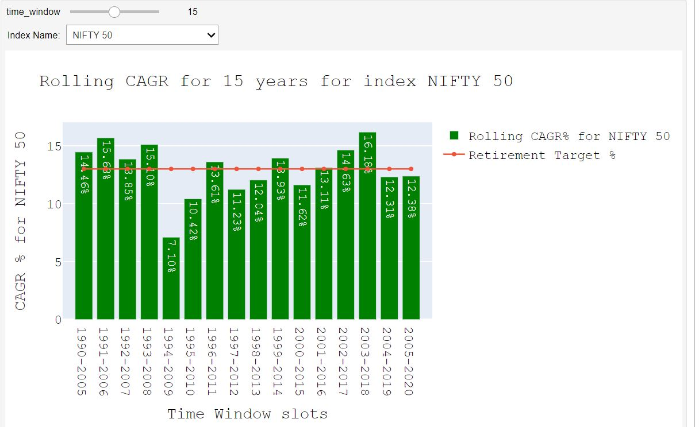

# Indian_Stock_Market_Analysis
Personal Finance passion project by Karthik Anumalasetty

I provide both youtube video analysis explanation and live demo of my jupyter notebook. Direction & links are provide below.  

I explained financial analysis in a video and shared it on youtube, click on the image below to goto youtube page

[Live Demo of Jupyter Notebook](https://kyso.io/karthikAnumalasetty/indian_stock_market_analysis/file/NIFTY_50_ROLLING_CAGR_Analysis.ipynb#code=shown)

